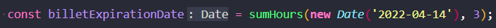
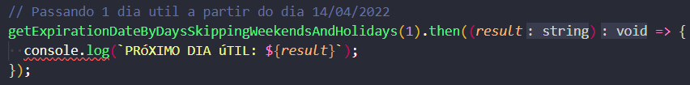
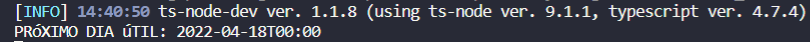
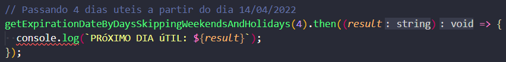
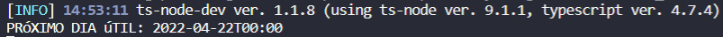
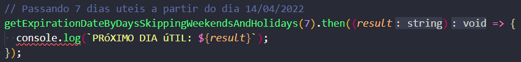
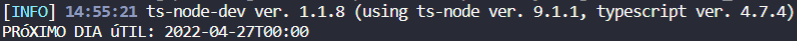
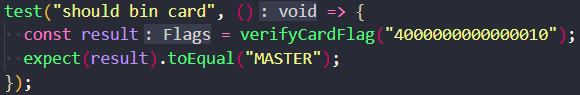
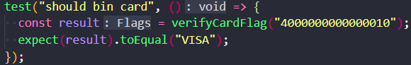
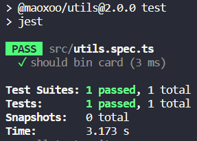

<h1 align="center"> Funções uteis </h1>

Uma biblioteca NPM para funções uteis no dia a dia do programador.

 

# Índice

- [Acesso a biblioteca ](#Acesso-a-biblioteca)

# :hammer: Funcionalidades do projeto

## :date: Calcular dias uteis para vencimento.

Criado para calcular os dias uteis para vencimento de boletos, pulando assim os feirados e finais de semana.

Os testes a seguir foram feitos com o mês de abril de 2022, onde temos 2 feriados (Paixão de cristo 15/04 e Tiradentes 21/04).

  

 
 

- <b>`Fixando o dia 14/04/2022:`</b>
  
    
- <b>`Exemplo 1`: Calcular 1 dia útil a partir de 14/04/2022, pulando os dias 15 (feriado), 16 e 17 (fim de semana) e trazendo o dia 18, a próxima segunda-feira.</b>
  
  
    

- <b>`Exemplo 2`: Calcular 4 dias uteis a partir de 14/04/2022, pulando os dias 15 e 21 (feriado), 16 e 17 (finais de semana) e trazendo o dia 22, a próxima sexta-feira.</b>
  
  
    

- <b>`Exemplo 3`: Calcular 7 dias uteis a partir de 14/04/2022, pulando os dias 15 e 21 (feriado), 16, 17, 23 e 24 (finais de semana) e trazendo o dia 22, a próxima sexta-feira.</b>
  
  
    

## :credit_card: Descobrir a bandeira do cartão de crédito.

Criado para retornar a bandeira do cartão, passando o número do cartão ou o bin (6 primeiros dígitos)
  

- <b>`Exemplo 1`: Passando um cartão fictício gerado automaticamente da bandeira Visa e esperando um Master no resultado.</b>
  
  
    

- <b>`Exemplo 2`: Passando o mesmo cartão, agora esperando a bandeira correta, Visa.</b>
  
  
    

  # 📁 Acesso a biblioteca

  **https://www.npmjs.com/package/@maoxoo/utils**
   

- <b>`Como instalar:`</b>
  _npm i @maoxoo/calculate-billet-expiration_
  ou
  _yarn @maoxoo/calculate-billet-expiration_
   

- <b>`Importando:`</b>
  **TypeScript:**
  _import { getExpirationDateByDaysSkippingWeekendsAndHolidays } from "@maoxoo/calculate-billet-expiration";_
   

  **JavaScript:**
  _const expirationDate = require("@maoxoo/calculate-billet-expiration");_

## ✔️ Técnicas e tecnologias utilizadas

- `TypeScript`
- `VS Code`
- `date-fns`
